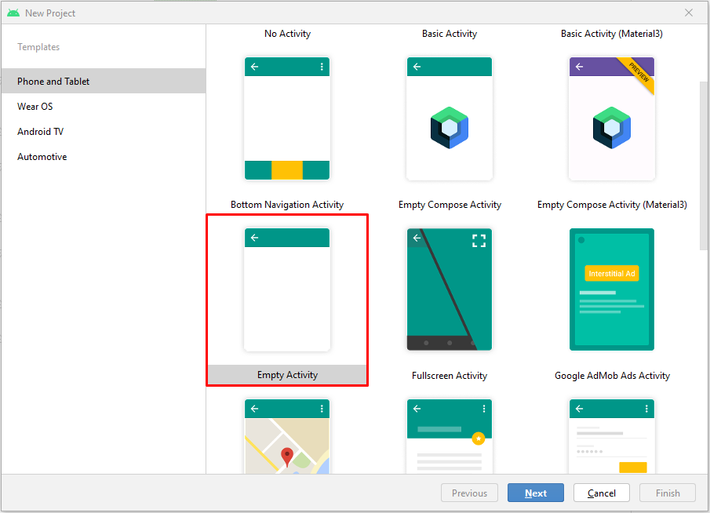
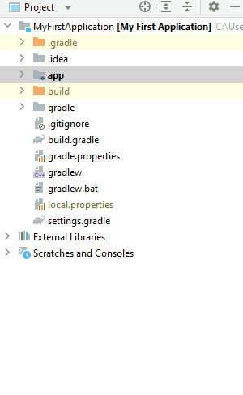
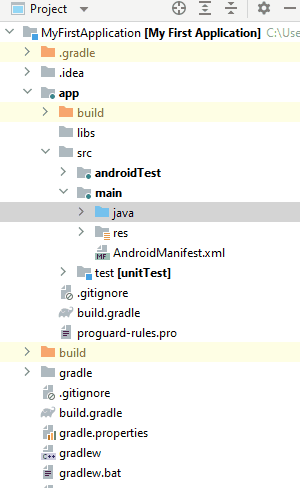
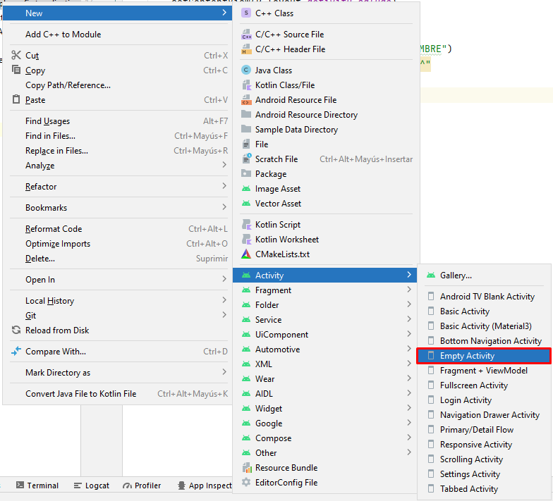
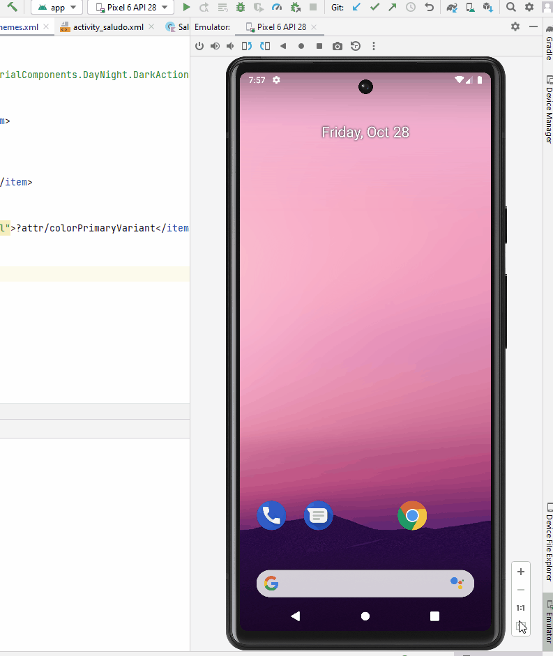

##### Raúl López-Bravo de Castro        DAM2

# Desarrollo de una interfaz sencilla en Android

### [Link del código de la aplicación](https://github.com/raulop194/App-Sencilla-Task4)

## Requisitos
 - Android Studio
 - Cualquier emulador o simulador conectado por el pueto **ADB** ( _Android Data Bridge_ )

## Comenzando
1. Primero crearemos un nuevo projecto con la plantilla de **_Empty Activity_**



2. Una vez creado el proyecto nos dirigiremos al paquete principal 

  

y crearemos el una nueva actividad llamada _SaludoActivity.kt_ que tambien nos creara el layout _activity_saludo.xml_



3. Dentro de la actividad _Saludo_ podremos el siguiente codigo:
```kotlin
class SaludoActivity : AppCompatActivity() {

    private lateinit var txtSaludo: TextView // Contiene el objeto TextView

    // Evento de creación de la actividad
    override fun onCreate(savedInstanceState: Bundle?) {
        super.onCreate(savedInstanceState) // Crea la actividad
        setContentView(R.layout.activity_saludo) // Con la siguiente vista

        // Referenciamos el componente con id "txtSaludo"
        txtSaludo = findViewById(R.id.txtSaludo) 

        // Obtenemos el 'Intent' NOMBRE y lo insertamos en la TextView
        val saludo = intent.getStringExtra("NOMBRE")
        txtSaludo.text = "Hola $saludo, bienvenido ^^"
    }
}
```
y en la actividad **Principal** o _Main_ esto otro:
```kotlin
class MainActivity : AppCompatActivity() {

    private lateinit var txtName: EditText // Contiene el componente EditText
    private lateinit var btnAceptar: Button // Contiene el componente Button

    // Evento de creación de la actividad
    override fun onCreate(savedInstanceState: Bundle?) {
        super.onCreate(savedInstanceState) // Crea la actividad
        setContentView(R.layout.activity_main) // Con la siguiente vista

        // Referenciamos al campo de texto
        txtName = findViewById(R.id.txtNombre) 
        // Referenciamos el botón de envio
        btnAceptar = findViewById(R.id.btnAceptar)

        // Creamos un Listener para el boton para cuando se pulse 
        // haga esta acción
        btnAceptar.setOnClickListener {
            
            // Crea un "Intent" desde esta actividad a SaludoActivity
            val intent = Intent(this@MainActivity, SaludoActivity::class.java)
            // La llamamos "NOMBRE" con el valor que se encuentre en campo
            intent.putExtra("NOMBRE", txtName.text.toString())

            startActivity(intent) // Comenzamos la actividad
        }

    }

}
```
Ahora editaremos las vistas.

4. Nos dirigiremos a la carpeta de layouts y modificaremos el codigo del layout de _SaludoActivity_ al siguiente

```XML
<?xml version="1.0" encoding="utf-8"?>
<LinearLayout xmlns:android="http://schemas.android.com/apk/res/android"
    android:id="@+id/lytContenedorSaludo"
    android:layout_width="match_parent"
    android:layout_height="match_parent"
    android:orientation="vertical" >

    <TextView
        android:id="@+id/txtSaludo"
        android:layout_width="match_parent"
        android:layout_height="225dp"
        android:text=""
        android:textSize="60sp" />

</LinearLayout>
```

Y el de _MainActivity_:

```XML
<?xml version="1.0" encoding="utf-8"?>
<LinearLayout xmlns:android="http://schemas.android.com/apk/res/android"
    android:id="@+id/lytContenedor"
    android:layout_width="match_parent"
    android:layout_height="match_parent"
    android:orientation="vertical" >

    <TextView android:id="@+id/lblNombre"
        android:layout_width="wrap_content"
        android:layout_height="wrap_content"
        android:text="@string/nombre" />

    <!--Hay que especificar la id en ambos-->
    <EditText android:id="@+id/txtNombre" 
        android:layout_width="match_parent"
        android:layout_height="wrap_content"
        android:inputType="text" />

    <Button android:id="@+id/btnAceptar"
        android:layout_width="wrap_content"
        android:layout_height="wrap_content"
        android:text="@string/aceptar" />

</LinearLayout>
```

Con esto ya estaria escrita la funcionalidad de la aplicación. Ahora procederemos a compilarla, ejecutarla y probar si esta bien.

## Compilación y prueba
1. Comprobaremos primero si tenemos un dispositivo conectado por **ADB** en Android Studio. En mi caso es un **Pixel 6 con la APi 28** en el simulador nativo de Android Studio. Y le daremos al _PLAY_ si es así. 


2. La aplicación se empezara a compilar y si no hay ningún problema en este proceso, se instalara en el dispositivo y se ejecutará.

3. Como resultado la aplicacion nos deberia dejar hacer lo siguiente



Si ha hecho lo anterior significaria que has seguido bien los paso y ha conseguido ejecutarse.


